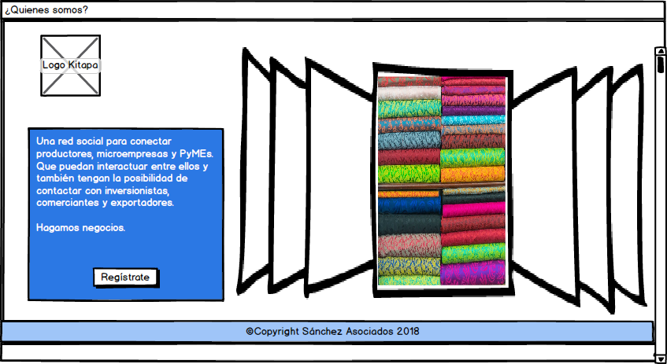
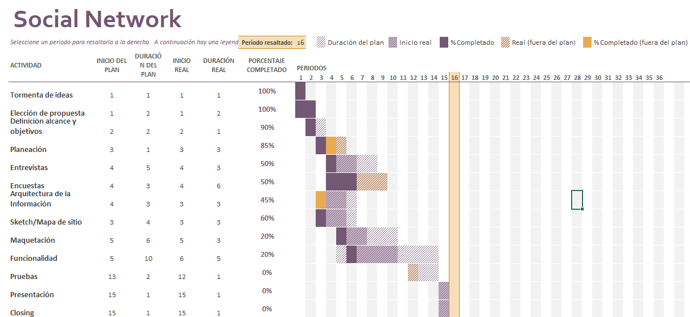

# Kitapa
 

**Sánchez Asociados**

Daniela Castillo Sánchez, Ana Laura Sánchez Tamayo

*Tonalá #30*

*Cuahutemoc, CDMX*

## Misión

Realizar la proyección, desarrollo e implementación de una red social que permita la conexión y acercamiento de Pymes y pequeños productores en contacto con inversionistas y exportadores posicionados, de manera que ambas partes puedan encontrar beneficio de su alianza, propiciando el comercio justo y la activación económica. 

## Visión

Que el producto final se vuelva una red social popular y novedosa que se posicione como la favorita dentro de los usuarios y que permita consolidar su éxito dentro del mercado regional y global. 

## Objetivos Generales

* Realizar la proposición, maquetación y programación de una red social novedosa. 
* Posicionarla como la favorita de los usuarios, atendiendo a un target específico.

## Objetivos Específicos 

En el mundo actual muchos inversionistas optan por la creación de productos digitales como nueva puesta por generar una ganancia, por lo que una red social se considera como uno de los productos más completos y con mayor facilidad para realizar la captación de activos a traves del uso de las TICs. 

### Requerimientos:

* Perfiles de usuarios
* Un newsfeed donde puedes ver las actualizaciones de todos tus
contactos
* Un lugar donde poder escribir posts
* Un lugar para subir fotos
* Capacidad para poder tener amigos o para poder seguir a
personas/marcas dentro de la red social
* Ser mobile friendly
* Tomar en consideración a los usuarios para garantizar un retorno de inversión seguro. 

## Milestones

1.- **Producto novedoso**
	Como resultado de la falta de soluciones a las necesidades que presenta el target de usuarios seleccionados. 

2.- **Consolidarse como la red predilecta de los usuarios**
	A través de la solución de éstas necesidades y la satisfacción de los usuarios a sus inquietudes monitoreándolas de forma constante, de manera tal que también se cumplan los objetivos del negocio. 

         

## Justificación

En la actualidad los inversionistas buscan una manera efectiva de mover su inversión y llegar a más personas, por lo que los productos digitales son una opción efectiva siempre que se lleven a cabo de la manera adecuada. Una red social fue el producto encargado y fue aquí donde múltiples posibilidades se conjuntaron para lograr los requerimientos solicitados y dar paso a la innovación, quisimos desde inicio que la inversión no solo sirviera para crear un negocio rentable, sino que tuviera labor social, de esta manera tratamos de encontrar una necesidad a la que nuestro proyecto surgiera como una solución efectiva. 

Así fue como decidimos crear Kitapa una red social en donde productores, microempresas y PyMEs puedan interactuar entre ellos de manera efectiva y directa, facilitando la comunicación, la información y el intercambio de ideas e inquietudes. Actualmente estas personas quedan a la deriva en su necogio y enfrentan retos diversos para mantenerse en el mercado, que su necogio se mantenga y además emprender un crecimiento y/o lograr exportar sus productos o servicios; muchas veces no tienen nociones sobre el uso de Internet pero si consideran que puede ser una herramienta que los apoye a lograr sus metas, tienen la inquietud de llevar su terreno de juego al comercio digital y comenzar a tener una mayor comunicación entre competidores, gremio y proovedores; que mejor manera de que empiecen a adentrarse en el mundo digital que a traves de una red social intuitiva y que genere confianza.

Además se considera que también tengan la oportunidad de contactar con inversionistas, comercializadoras y exportadoras que los ayuden a posicionarse mejor y lograr un crecimiento de su negocio o actividad económica más efectivo.  Haciendo un poco del uso de trade marketing, donde se busca aumentar la demanda al nivel del distribuidor o minorista. En resumen, una red social de negocios.

**¡Hagamos negocios!**

## Proceso

### Entrevista 

Realizar entrevistas con los usuarios de la plataforma, de manera que podamos conocer y entender sus necesidades y definir cual es el target al que nos vamos a dirigir. Además de poder arquitectar la información que se va a manejar dentro de la misma. Se entrevistó a 4 personas en diferentes, todos relacionados con alguna actividad económica de la cadena productiva y económica. 

En el documento siguiente podemos ver la transcripción de las entrevistas,

URL: https://docs.google.com/document/d/1hhwJ0piOpaulNlLbHCKx03DRy3a3fnDSoOxxB2XN7EA/edit?usp=sharing 

Al respecto de la información obtenida se obtuvieron las siguientes conclusiones: 

* Los usuarios han tenido dificultad para realizar la expansión de su negocio o exportación de su producto debido a falta de información, capital para inversión y contactos.
	* Consideran que una red social es un buen medio de implementar el uso de Internet en beneficio de sus negocios, lo que les ayudaría con los retos a los que se enfrentan día con día. Sin embargo mencionan que es necesario tomar en cuenta que muchos productores o pequeñas empresas aún manifiestan desconfianza o desconocimiento en el uso del mismo.
	* Herramientas y aspectos con los que les gustaría que la red social contará: 
	* Perfil. Un espacio que reúna los aspectos generales e importantes de las empresas. 
	* Organización y clasificación por giro. Con lo que también la búsqueda se pueda llevar a cabo con filtros específicos como región, productos y servicios, etc. 
	* Seguridad en la información y confiabilidad. Verificar el background de las empresas.
	* Arbitraje para garantizar operaciones.
	* Que haya forma de mantenerse en contacto con convocatorias gubernamentales de apoyo económico. 

### Encuestas 

Con la información obtenida de las entrevistas procedimos a elaborar una encuesta más generalizada. Consta unicamente de 10 preguntas que consideramos nos ayudaria a definir de forma mas clara las necesidades e inquietudes de nuestro usuarios, tomar en cuenta sus impresiones y opiniones respecto del producto. 

URL: https://goo.gl/forms/M8w3S8cYz2rg5p7Y2

 

## Maquetación 

Se diseñó una maquetación de interfaz amigable con el usuario utilizando algunos elementos que ya son característicos de las redes sociales actuales, para ayudar al usuario con  experiencia a familiarizarse con el uso de la red, y guiar de manera intuitiva a la personas que comienzan a hacer uso de las TICs. 
Se eligió una paleta de colores con azul, debido a que se pretende transmitir una sensación de confianza y fiabilidad en los usuarios, imágenes que realicen conexión con lo que nuestros usuarios realizan. 

Iniciamos con la vista principal, optamos por la simplificación: una imagen agradable, y 2 secciones a la vista, la barra de navegación fija con el logo del lado izquierdo y del lado derecho el botón de inicio de sesión, que abre un modal para ingresar usuario, contraseña, boton de ingreso y opción de olvido de contraseña; y otro que lleva a la sección donde se describe mejor el motivo del producto; en medio y del lado izquierdo se invita a tomar acción realizando el registro de un nuevo usuario, este botón abre un modal para registro de dato adicionales de la cuenta, como: tipo de usuario, nombre de usuario, RFC, etc. Si el usuario no considera que la información de esta vista es suficiente, no toma acción al registro o no da click en el botón de más información, haciendo scroll también puede ver la descripción del producto.

En esta vista se describe un poco más  sobre lo que es Kitapa. La vista cuenta con un cuadro te texto fijo enmedio a la izquierda debajo del logo y un botón que invite nuevamente al usuario a registrarse, este botón abre el modal de registro anteriormente descrito. . Del lado derecho un carrousel de imágenes con texto breve pero descriptivo que motive al usuario a realizar el registro. 

Una vez que el usuario realiza su registro o  inicia sesión se le envía a la vista de noticias y tablero principal. 

* **Barra de navegación fija:** En el extremo izquierdo un icono de menú, al presionarlo se despliega un menú superpuesto con del lado izquierdo con transparencia. A continuación se muestra el logo; y del lado derecho tenemos iconos que apoyen al usuario a tener a la mano las funciones más usadas en la red social: Perfil, noticias, notificaciones, mensajes y configuración. Incluimos un campo de búsqueda rápida y un icono de ayuda.

* **Menú desplegable:**  Contiene foto del usuario y su nombre, donde al hacer click lo dirige a su perfil. Ya en los botones de menú tenemos la siguiente lista: Búsqueda, favoritos, contactos, mensajes, eventos, proyectos, market, ayuda. 

* **Sección principal:**
	* **Área para ingresar post:** Incluye área para ingresar descripción o texto,  iconos de acción del post (agregar media, transmitir en vivo, agregar documento, agregar contacto, realizar encuesta) y botón de publicación. 
	* **Publicaciones de contactos:**  debajo del área de post se pueden visualizar los post de otros usuarios y amigos, se puede interactuar con los mismos teniendo una reacción o comenzando un chat respecto de la publicación con el creador. 
	* **Espacio para publicidad:**  Discreto, en el extremo izquierdo superior, con un ancho del 20% de la pantalla total máximo. 
	* **Chat:** De momento esta sección es para ver contactos en línea y poder enviar mensajes, se pretende que a futuro, pueda ser espacio para poder minimizar una videollamada mientras se realizan otras tareas en la red social. 

## Código y funcionalidad

## Planeación

## Producto Final

